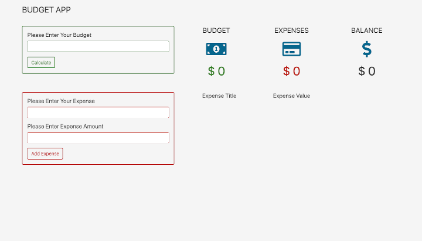

# budget-app
## Table of contents
* [General info](#general-info)
* [Screenshots](#screenshots)
* [Technologies](#technologies)
* [Setup](#setup)
* [Features](#features)
* [Status](#status)
* [Inspiration](#inspiration)
* [Contact](#contact)

## General info
Code-Along exercise for practicing JavaScript, HTML, CSS.

## Screenshots

## Technologies
* JavaScript
* HTML
* CSS
* `Bootstrap` 
* `font-awesome library`
* GIT

## Setup
Fork, or clone this repository

## Features
List of features ready:
* Add a budget to the list.
* Add a expense to the list.
* Edit or delete the expense form de list.
* Calculate the final valance after any operation. 

## Status
Project is: _finished, final version_

## Inspiration
[`Javascript Project Tutorial: Budget App`](https://www.youtube.com/watch?v=m_HJ3juuFvo) tutorial from freeCodeCamp.

## Contact
Created by [@Elisa0045](https://github.com/Elisa0045) - feel free to contact me!